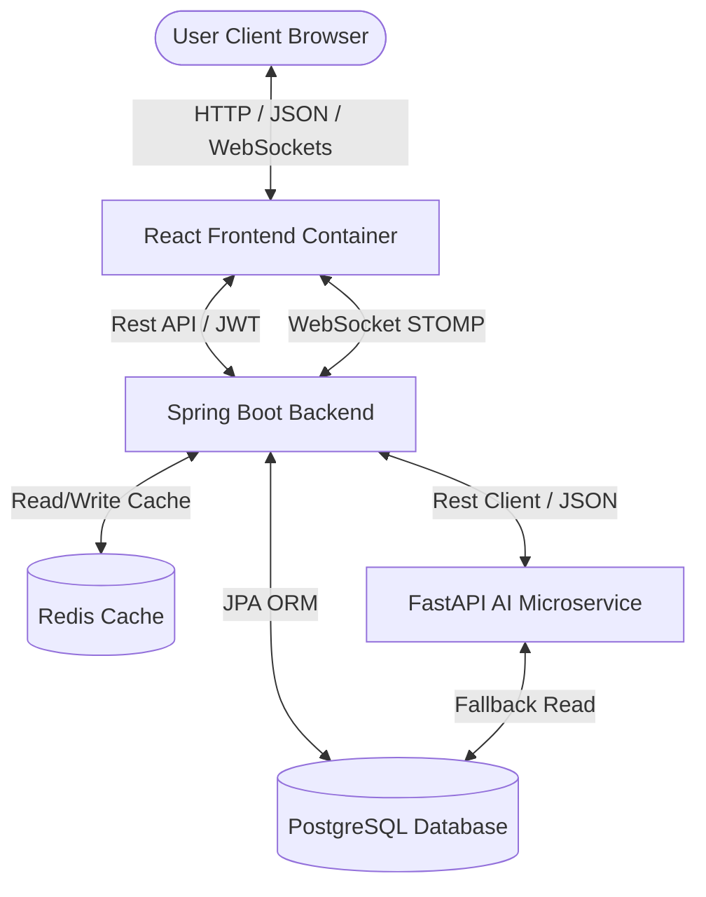

# Online Smart Business Analytics & Decision Support System (SBADSS)

An enterprise-grade, multi-tier business intelligence and decision support platform designed for retail, franchise, and multi-branch operations. SBADSS leverages a Java Spring Boot backend, a modern React frontend, and a FastAPI AI/ML microservice to deliver real-time operational analytics, automated reporting, sales forecasting, customer churn predictions, and an interactive NLP decision support chatbot.

---

## 🏗️ System Architecture

SBADSS is designed using a containerized, decoupled service-oriented architecture:



- **Frontend Tier**: A React client styled with Tailwind CSS, using Zustand for state management, Recharts for visual analytics, and SockJS + STOMP for real-time WebSocket feeds.
- **Backend Tier**: A Spring Boot application executing business logic, managing transactions, executing background schedules, exporting files (PDF/Excel), and enforcing security (JWT, Spring Security).
- **Caching & Persistence**: PostgreSQL for relation persistence; Redis for low-latency caching of complex analytics data.
- **AI Microservice**: A FastAPI service running Python-based ML and NLP pipelines.

---

## ✨ Key Features

### 1. Real-Time Operational KPI Dashboard
- **Live Widgets**: Real-time sales transactions, notifications, and inventory alerts delivered via WebSockets (`/ws-analytics` STOMP endpoint).
- **Interactive Analytics**: Rich data visualizations (sales trends, product comparisons, expense distributions) driven by Recharts.
- **Multi-Branch Context**: Seamless toggle between consolidated analytics and branch-specific data.

### 2. AI-Powered Sales Forecasting
- **Prophet Engine**: Advanced time-series forecasting using Facebook Prophet, factoring in yearly and weekly seasonality with multiplicative parameters.
- **Confidence Intervals**: Generates expected values along with upper and lower confidence bounds.
- **Graceful Fallback**: Dynamically reverts to an internal linear moving average projection if the AI microservice is unreachable.

### 3. Customer Churn Analytics
- **Sklearn Predictor**: A Logistic Regression classifier trained on customer CRM metrics (days since last purchase, total purchase frequency, average order value).
- **Risk Profiling**: Segments customers into `HIGH`, `MEDIUM`, or `LOW` churn risk levels.
- **Actionable Advice**: Dynamically provides tailored customer retention recommendations based on calculated risk.

### 4. NLP Business Decision Chatbot
- **Intent Classifier**: An NLP pipeline that parses query syntax using token normalization and regular expression pattern matching.
- **Dynamic Context**: Intercepts intents to query the Spring Boot backend REST endpoints, delivering real-time responses about revenue, profit, expenses, and best-selling products.
- **Strategy Advisor**: Recommends business actions based on branch growth trends.

### 5. Enterprise Reports & Exporting
- **PDF Generation**: Renders clean, structured PDF files for invoices and sales reports using `iText 7`.
- **Excel Generation**: Exports complex financial worksheets (automatic column sizing, stylized header blocks) using `Apache POI`.
- **Automated Schedulers**: Configurable cron jobs executing daily/weekly/monthly email distributions to designated recipients.

### 6. Role-Based Access Control (RBAC) & Auditing
- **Fine-Grained Security**: Custom JWT filters inspecting Authorization headers and verifying credentials.
- **Method Security**: Controllers protected via Spring Security's `@PreAuthorize` tags (e.g., `hasAnyRole('ADMIN', 'MANAGER')`).
- **Audit Logging**: Aspect-Oriented Programming (`AuditLogAspect`) capturing all service manipulations (create, update, delete, import) with user identity, class, execution details, and caller IP address.

---

## 🛠️ Technology Stack

| Tier | Component / Library | Purpose |
| :--- | :--- | :--- |
| **Frontend** | React 19 + Vite | Component-driven UI development & fast building |
| | Tailwind CSS v4 | Utility-first responsive web styling |
| | Zustand | Client state management |
| | Recharts | Interactive charts and analytics visualizations |
| | SockJS + STOMP | Real-time WebSocket communications |
| | Axios | REST API client |
| **Backend** | Spring Boot 3.3.0 | Framework core and REST APIs |
| | Spring Security + JWT | Identity verification & request authorization |
| | Spring Data JPA | ORM mapper for PostgreSQL/H2 |
| | H2 Database | Fast, fail-safe in-memory database (Development Profile) |
| | Redis | Analytics cache |
| | iText 7 | Core PDF generation |
| | Apache POI | Excel document creation |
| **AI Service**| FastAPI | High-performance Python REST API |
| | Facebook Prophet | Time-series forecasting model |
| | Scikit-Learn | Logistic Regression churn predictor & Scaler |
| | Pandas & NumPy | Scientific data structures & manipulation |
| **DevOps** | Docker & Docker Compose | Multi-container environment orchestration |

---

## 📁 Project Directory Structure

```text
Smart Business Analytics And Decision Support System/
├── backend/                             # Java Spring Boot Backend Source
│   ├── src/main/java/com/sbadss/
│   │   ├── aspect/                      # AOP Aspects (AuditLogAspect)
│   │   ├── config/                      # App configs (WebSockets, Redis, Seeder)
│   │   ├── controller/                  # REST API Controllers (V1)
│   │   ├── dto/                         # Data Transfer Objects
│   │   ├── entity/                      # JPA Database Entities
│   │   ├── mapper/                      # Entity-DTO Conversion Mappers
│   │   ├── repository/                  # Spring Data Repositories
│   │   ├── scheduler/                   # Automated cron report schedulers
│   │   ├── security/                    # JWT filters and RBAC evaluators
│   │   ├── service/                     # Service Layer interfaces
│   │   └── util/                        # Shared constants & helper messages
│   └── src/main/resources/
│       ├── application.properties       # Base Properties
│       ├── application-dev.properties   # Development profile properties (H2 DB)
│       └── application-docker.properties# Containerized environment configurations
├── frontend/                            # React + Vite Client Source
│   ├── src/
│   │   ├── components/                  # Reusable UI widgets & modals
│   │   ├── pages/                       # Screen routes (Dashboard, Sales, CRM)
│   │   ├── services/                    # API clients (Axios & WebSocket clients)
│   │   ├── store/                       # Zustand state stores (Auth, Analytics)
│   │   ├── App.jsx                      # Routing & navigation wrapper
│   │   └── index.css                    # Global styling & Tailwind CSS imports
│   ├── Dockerfile                   
│   └── package.json                 
├── ai-service/                          # Python AI/ML Microservice
│   ├── app/
│   │   ├── api/                         # FastAPI route routers (forecast, churn, chatbot)
│   │   ├── schemas/                     # Pydantic input/output validation models
│   │   ├── services/                    # ML/NLP services (Prophet, LogisticRegression)
│   │   └── main.py                      # FastAPI application entry point
│   ├── Dockerfile
│   └── requirements.txt
├── reports/                             # Target output directory for generated reports
├── pom.xml                              # Maven Root dependencies configuration
├── docker-compose.yml                   # Docker Compose Cluster script
└── Dockerfile                           # Spring Boot packaging configuration
```

---

## 👥 Seed Accounts & Authorization Matrix

The system automatically runs [DataSeeder.java](file:///c:/Users/User/Desktop/Smart%20Business%20Analytics%20And%20Decision%20Support%20System/backend/src/main/java/com/sbadss/config/DataSeeder.java) on startup, establishing core Roles, 10 branches (Colombo, Kandy, Galle, etc.), 50 products across 10 categories, 20 sample customers, and default credentials:

| Username | Password | Role | Description |
| :--- | :--- | :--- | :--- |
| `admin` | `admin123` | `ADMIN` | System Administrator (Full Access) |
| `manager` | `manager123` | `MANAGER` | Branch Manager (Inventory, Reports, & Churn) |
| `cashier` | `cashier123` | `CASHIER` | Point of Sale Operator (Sales logging & CRM) |

### Authorization Matrix

- **Admins** have unrestricted access, including user management, branch modifications, and product definitions.
- **Managers** can record expenses, evaluate forecasting models, analyze customer churn risk, and trigger/download system reports.
- **Cashiers** are restricted to placing orders, registering customers, viewing product listings, and checking real-time sales statistics.

---

## 🚀 Getting Started

### Method A: Docker Compose Deployment (Recommended)
This runs the entire system with PostgreSQL and Redis. Make sure Docker Desktop is active.

1. Navigate to the project root directory.
2. Build and run all services in detached mode:
   ```bash
   docker-compose up --build -d
   ```
3. Once running, access the services:
   - **Frontend App**: `http://localhost`
   - **Spring Boot Backend API**: `http://localhost:8080`
   - **FastAPI AI API Docs**: `http://localhost:8000/docs`
   - **PostgreSQL Database**: `localhost:5432` (DB: `sbadss`, User: `postgres`, Password: `asal2003`)
   - **Redis Cache**: `localhost:6379`

---

### Method B: Local Developer Setup (Manual)

If you wish to run components individually without Docker:

#### 1. Running the Backend (Spring Boot)
By default, the `dev` profile uses an in-memory H2 database (no installation required).
1. Navigate to the project root.
2. Build the Maven package:
   ```bash
   mvn clean install
   ```
3. Run the application:
   ```bash
   mvn spring-boot:run -Dspring-boot.run.profiles=dev
   ```
4. The backend will run on `http://localhost:8080`. H2 Console is accessible at `http://localhost:8080/h2-console` (JDBC URL: `jdbc:h2:mem:sbadssdb`, User: `sa`, Password: empty).

#### 2. Running the AI Microservice (FastAPI)
1. Navigate to the `/ai-service` directory.
2. Create and activate a Python virtual environment:
   ```bash
   python -m venv venv
   # On Windows:
   venv\Scripts\activate
   # On macOS/Linux:
   source venv/bin/activate
   ```
3. Install dependencies:
   ```bash
   pip install -r requirements.txt
   ```
4. Start the development server:
   ```bash
   uvicorn app.main:app --host 127.0.0.1 --port 8000 --reload
   ```
5. Swagger documentation will be available at `http://localhost:8000/docs`.

#### 3. Running the Frontend (React + Vite)
1. Navigate to the `/frontend` directory.
2. Install npm modules:
   ```bash
   npm install
   ```
3. Spin up the development server:
   ```bash
   npm run dev
   ```
4. The client application will launch on `http://localhost:5173`.

---

## 📡 Essential REST APIs & WebSocket Destinations

### Spring Boot APIs
- **Authentication**: `POST /api/v1/auth/login` (Returns JWT token)
- **Analytics**:
  - `GET /api/analytics/dashboard` (Fetches core revenue, expenses, and product metrics)
  - `GET /api/analytics/profit-loss` (Profit/loss analysis)
- **Sales Logging**: `POST /api/sales` (Registers new transactions)
- **Customer CRM**: `GET /api/customers`
- **AI Recommendations**: `GET /api/v1/recommendations/churn/{customerId}` (Predicts churn for a customer)
- **Report Generation**:
  - `POST /api/v1/reports/generate` (Request a PDF/Excel report)
  - `GET /api/v1/reports/{id}/download` (Download generated report files)
- **WebSocket Gateway**: Endpoint `/ws-analytics`. Subscriptions are listened to on `/topic/sales`, `/topic/inventory-alerts`, and `/topic/notifications`.

### AI Microservice REST APIs
- **Sales Forecast**: `POST /api/v1/forecast/sales` (Prophet model calculations)
- **NLP Chatbot Query**: `POST /api/v1/chatbot/query` (Intent classification & analytics routing)
- **Churn Prediction**: `POST /api/v1/churn/predict` (Logistic Regression probability evaluation)
